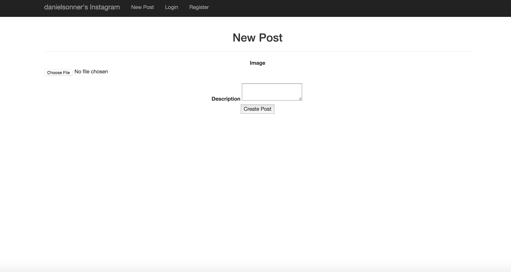
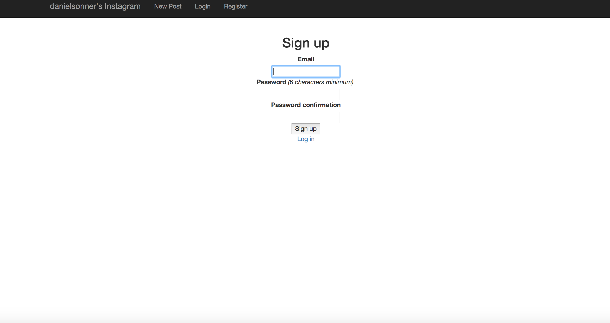

# assignment2instagram
This project was to make an instagram like site by following the tutorial
"Make an instagramlike site in under 30 minutes! (Ruby on Rails)" tutorail
located at https://www.youtube.com/watch?v=MpFO4Zr0EPE.

Below are some images:

View posts:

Sign in:

New Post:

Sing Up:
